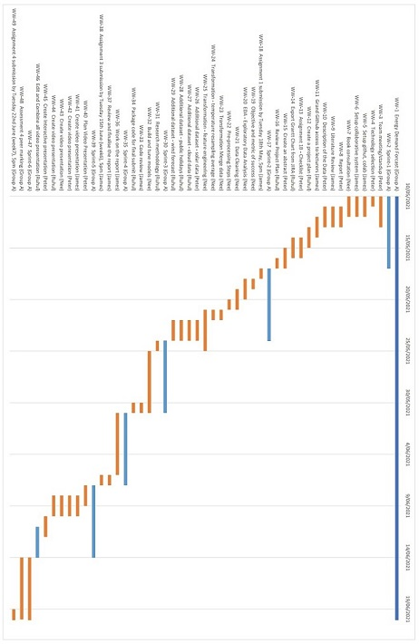

```{r setup, include=FALSE}
knitr::opts_chunk$set(echo = TRUE)
```

\setcounter{chapter}{1}
\renewcommand\thesection{\arabic{section}}

## Introduction and Motivation {.label:s-intro}

We aim to create a model that can predict the demand for electricity to a higher degree of accuracy that the current methods used for forecasting demand. We believe that the gap between forecasted and true demand is partly explained  by accounting for solar panels and their usage throughout the day. Thus using temperature data, as well as other external datasets such as solar data. We intend on using a Neural Network to fill-in the gaps between the current forecasted and true demand. Given that the current RMSE between forecasted and true electricity demand is roughly 85.87, the measure of success for this project is to build a more accurate model with an RMSE of at most 75. By taking into account solar panel usage, we intend on building a model that can predict electricity demand with more certainty.


## Brief Literature Review

Since 1998 the East Coast  Australian Energy Market has been driven by the National Energy Market (NEM). This is an organisation that since 2005 has rules set by the Australian Energy Market Commission (AEMC) and since 2009 the operational day to day management of the NEM has been managed by Australian Energy Market Operator (AEMO).
The NEM is accountable for matching the supply and demand of the Electricity market, it does this through 2 main mechanisms, a spot market that ensures electricity in real time, and sends signals to the electricity suppliers to power up and down generators, and contract market that provides surety in electrical supply in the long term.
Roof top solar has been on the increase form 0.2% od houses in 2007 upto 20% of houses in 2020. This increase is expected to continue with the AEMO predicting that by 2030 up to 30000MW of electricity will be generated by Solar \cite{aemo_2020_projections}  and is expected to be one of the largest impacts to energy demand, Roof top solar provides individual houses with their electricity needs during high solar periods, as such they are not putting load on the grid \cite{parkinson_2019_rooftop} . The current forecast models that are created by the AEMO do not include the rooftop solar as part of their demand, as it is not required to be included in either the contract or spot markets.Whilst Modeling has been done in other locations that include rooftop solar, it has not been included in the NEM data todate \cite{aemo_electicity}. Techniques such as linear regressions, neural networks have been used to model Energy Demand Data in the past\cite{marcjasz_2008_neural}, however to date the inclusion of solar information has not been included in the NSW modeling\cite{nem_2021_mms}. Our investigation intends to use either synthetic solar information based on the bankstown latitude and longitude as being representative of the solar profile of NSW (based on the current population density of people in NSW). This data would then be used to increase the accuracy of the current AEMO predicted demand calculations, providing a more accurate RMSE.


## Methods, Software and Data Description

In terms of the data, we intend on using solar data, NSW Public Holiday data, temperature,  forecast and total demaind electricity datasets and potentially cloud and wind speed data. Whilst we are aware that getting more accurate measurements of wind & cloud coverage will require much greater granularity and that these features do significantly change over a geographical area, this level of granular data would also require collecting information about the locations of rooftop solar panels, which is not possible. Thus, we are making the assumption that the external datasets reflect the true wind & cloud coverage rates of a region at a given point in time. As 90% of the population is located near Sydney we have used the climate zone information based on this region\cite{abcb_2015_climate}. 

For this project, we plan on using Python as the main language for data preparation, analysis and modelling. Python was selected over R due to the common familiarity amongst the entire team, and it is well established amongst the Data Science community that Python is the language-of-choice for machine learning. For our presentation, we intend on using Powerpoint, a Google collab notebook, and a Rshiny/Power BI dashboard for interactive analysis.

Neural Networks are known to handle noisy data well compared to other models, and given the noisy nature of the electricity demand & temperature data, this seems appropriate to use a Neural Network for modelling. Additionally, since electricity demand & temperature data appears to have some form of seasonality, we would like to build a model that can capture patterns in the data, which would be possible with Neural Networks. As the data is time-based, we are inclined to use an LSTM or GRU form of a Neural Network (both will be built & tested), as these models retain information from the past when predicting future values.


## Activities and Schedule

Our Project team has chosen to use an agile methodology for managing the project, for this we are using the Jira tool. Due to the nature of the team members schedules, and geographical dispersion, the work is being managed via a wall of work with all team members “pulling” work as they are able. To ensure that the work is being completed the team has daily communications via whatsapp in the form of a daily standup, with a Wednesday night checkpoint meeting, and a Saturday sprint planning and retrospective.

Due to the aggressive timeframe of the project the work has been structured as a single epic, with larger components being managed as a story but the majority of the elements being managed as tasks.

We have chosen to load many of the tasks into the initial sprint, while recognising that the majority of this will spill over into future sprints. The Scrum manager role is being performed by Nee, however, this is likely to rotate based on individuals workloads throughout the project. The Project lead role is being perfomed by James. Peter is focusing on the development of the neural network model, and Ruhul is leading the visualisations. The pull nature of the agile mentodology means all team members will be involved with most tasks.

Task allocation is often being priotised for people wanting to learn the skills, with people with the current skills acting as reviewers, for instance James is performing the Rmarkdown to gain the skills whereas Peter is reviewing as he already has the skills. This way we ensure the team is able to provide backup for each other throughout the project.

The following table highlights the sprints and due date of the tasks.


\newpage




<!---
# References
-->

\bibliographystyle{elsarticle-num}
\bibliography{references}


